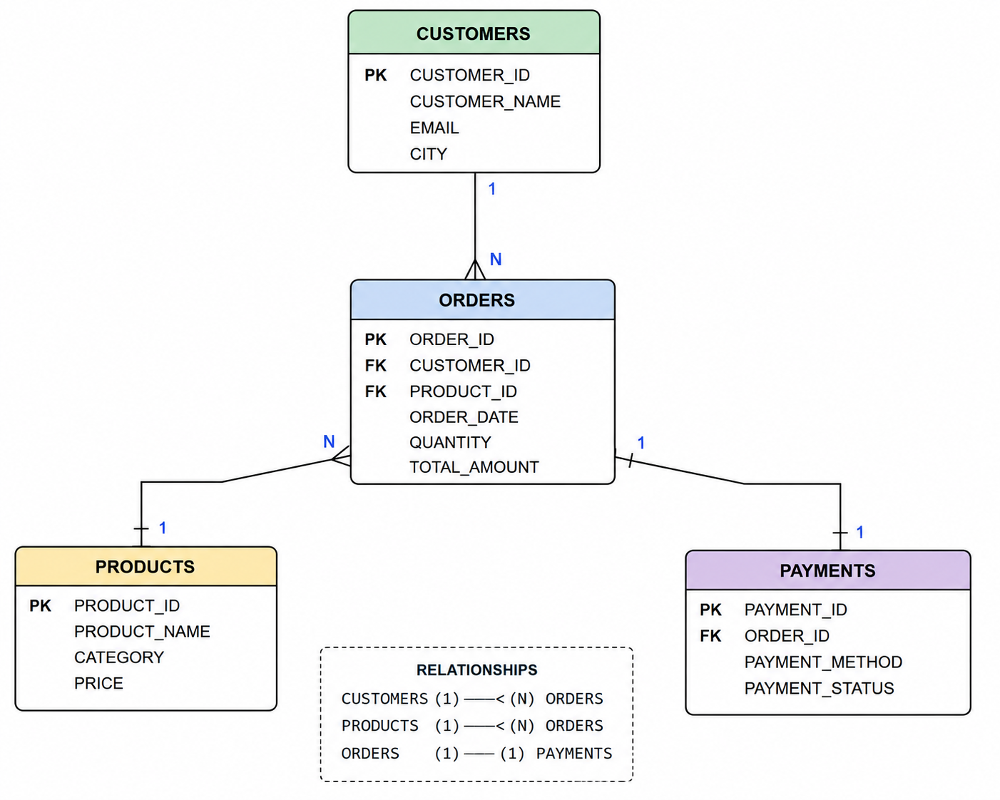

# 🛒 Retail Sales Analysis using SQL

# 📌 Project Overview

This project focuses on analyzing retail sales data using SQL to generate meaningful business insights.

The main objectives of this project are to:

- Analyze customer purchasing behavior
- Evaluate product performance
- Identify revenue trends
- Generate business insights from retail sales data

---

# 🗄️ Database Schema

The following ER Diagram illustrates the database structure and relationships used in this project.



---

# 🛠️ Tools Used

- MySQL
- SQL
- GitHub

---

# 📚 SQL Concepts Covered

- Database Creation
- Table Creation
- Data Insertion
- SELECT Queries
- WHERE Clause
- Aggregate Functions
- GROUP BY & HAVING
- ORDER BY
- INNER JOIN
- LEFT JOIN
- RIGHT JOIN
- Subqueries
- Common Table Expressions (CTE)
- Window Functions
- CASE Statements

---

# 📊 Business Analysis

This project answers several real-world business questions, including:
- Top customers by revenue
- Best-selling products
- Monthly sales trends
- Customer order frequency
- Category-wise revenue
- Average order value
- High-value orders
- Product performance analysis


# 📂 Project Structure

```text
SQL-Retail-Sales-Analysis
│
├── README.md
├── Images
│   └── ERDiagram.png
├── 01_database.sql
├── 02_create_tables.sql
├── 03_insert_customers.sql
├── 04_insert_products.sql
├── 05_insert_orders.sql
├── 06_insert_payments.sql
├── 07_business_queries.sql
├── 08_joins.sql
├── 09_subqueries.sql
├── 10_cte.sql
├── 11_window_functions.sql
├── 12_case_statements.sql
└── 13_advanced_business_queries.sql
-----

# ✨ Project Features

- Designed a normalized relational database
- Created four interconnected tables
- Implemented Primary Keys and Foreign Keys
- Performed SQL JOIN operations
- Used Aggregate Functions
- Implemented Subqueries
- Applied Common Table Expressions (CTEs)
- Used Window Functions
- Implemented CASE Statements
- Solved real-world business problems using SQL

# 📊 Business Insights

The SQL queries in this project help answer important business questions such as:

- Who are the top 5 customers based on total spending?
- Which products generate the highest revenue?
- What are the monthly sales trends?
- What is the average order value?
- How frequently do customers place orders?
- Which product categories generate the highest revenue?
- Which orders are considered high-value orders?

# 🎯 Learning Outcomes

This project helped me gain practical experience in:
- Database Design
- SQL Query Writing
- Data Analysis
- Business Reporting
- Relational Database Management
- Writing Complex SQL Queries
- Business Intelligence Concepts

# 🚀 Future Enhancements

- Add 100+ realistic retail sales records
- Build an interactive Power BI Dashboard
- Perform Exploratory Data Analysis (EDA) using Python
- Create automated SQL reports
- Add advanced business analysis queries
- Integrate dashboards with SQL datasets


# 👩‍💻 Author
**Jayanthi Surla**
🎓 MCA Student


### Skills
- SQL
- MySQL
- Excel
- Python
- Power BI
- Git
- GitHub

---

## ⭐ Project Status

✅ Completed

This project demonstrates practical SQL skills for Data Analyst roles and showcases database design, business analysis, and problem-solving using SQL.
